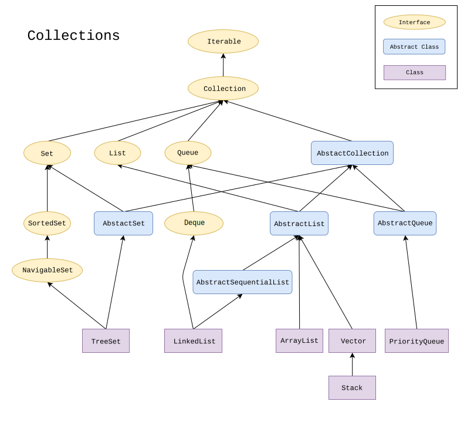
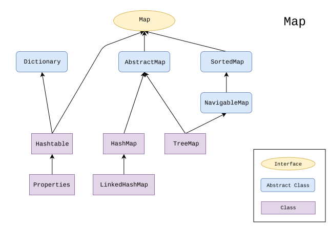
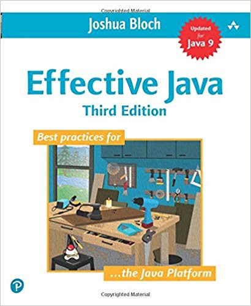

# Abstract Class & Interface

<small>Nathanael Yang</small>

<small>ny83427@gmail.com</small>

<small>https://www.oldyoungboys.club</small>

---

## What We've Learned So Far?
* Basic Java Programming
* Basic OOP Concepts
```
class and instance, constructor and new
attribute and method
static and instance
public/private/protected/default
package
```
* Development Tools & Boring Games

---

## Review of Chapter 4 Assignment
<!-- .element width="80%" height="80%" -->

---

## Popular Issues
* Didn't work as expected: Tested?
* Coding style: Ctrl+Shift+F
* Duplicated codes
* Issue of `scanner.nextLine()`

---

## Abstract Class & Interface
* Automobile
* Car, Truck
* Recyclable
* Thread or Runnable? inherit or delegate
* Sparrow -> Bird, Boyin -> AirPlane
* Bird/AirPlane --> Flyable

---

## Java Collections Framework
* Collection -> List/Set/Queue
* Map
* IDEA Ultimate: Class Diagram
* UML Tools: [Class Visulizer](http://www.class-visualizer.net/download.html)

---

## Java Collections Framework
<!-- .element width="80%" height="80%" -->

---

## Play With Them!
* ArrayList, Stack
* HashSet
* HashMap

---

## Java Collections Framework
<!-- .element width="80%" height="80%" -->

---

## [Joshua Bloch](https://en.wikipedia.org/wiki/Joshua_Bloch) & Effective Java
[](https://amzn.to/2AVnHTu)

---

## Mid-Term Project: Tank War
* Demo at [Youtube](https://www.youtube.com/watch?v=KzLuaX50pgs)
* Assets provided, painting method given
* Design and implement other classes
* Teamwork is allowed, single player also OK

---

## The End: Happy Coding!
<!-- .element width="80%" height="65%" -->

